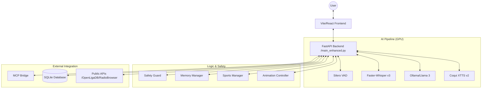

# System Architecture: Prism IPTV v2.2

## Components

- **Frontend**: Handles media playback (HLS.js), Virtualized TV Guide, Audio Dashboard, and VRM avatar rendering.
- **Backend**: Orchestrates AI and business logic.
- **GPU Cluster**: Dedicated hardware for real-time inference.
- **Memory**: Persistent vector-based retrieval.
