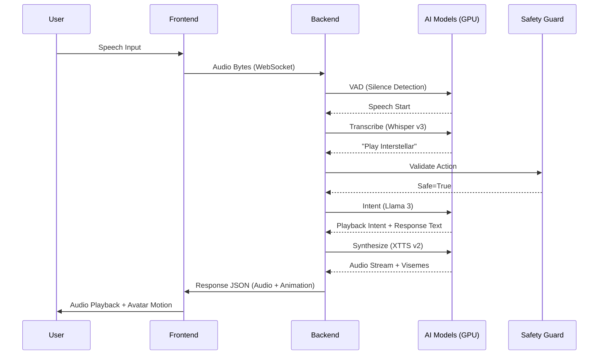

# Lumen AI Pipeline: Ear-to-Voice Flow

## Latency Optimization

- **Execution**: All heavy AI calls run in non-blocking executors.
- **Streaming**: Audio is chunked and streamed for immediate playback start.
- **Safety**: Parallel validation of user intent against safety policies.
