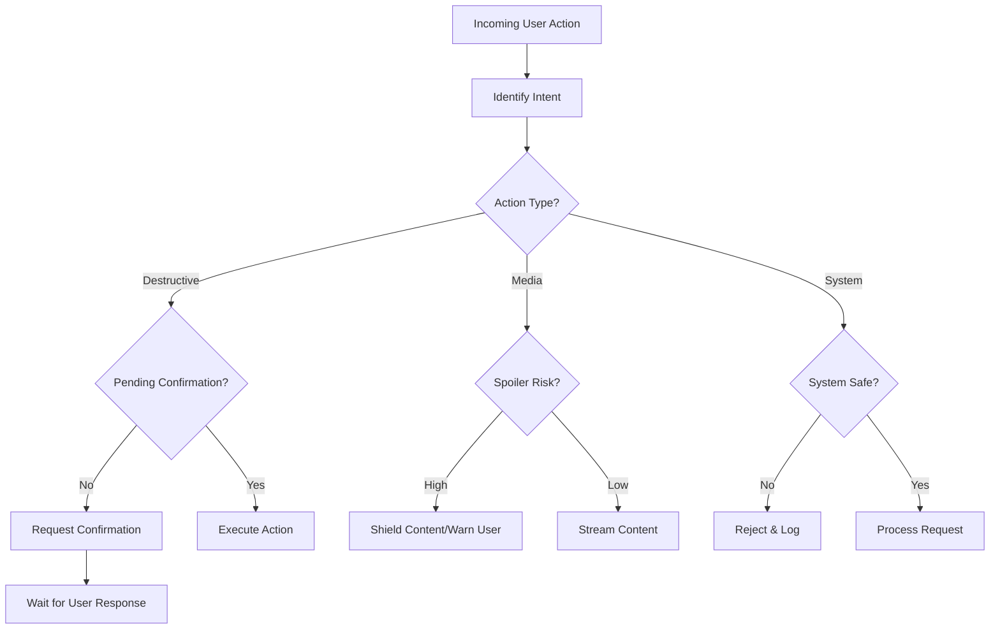

# Safety Guard: Operational Flow

## Safety Features

- **Hush Mode**: Immediate audio/transport override.
- **Spoiler Shield**: Metadata-aware blur and filtering.
- **Multi-Step Confirmation**: Prevents accidental data loss.
